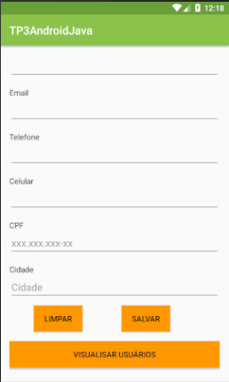

# Projeto AndroidJava
Pequeno projeto da faculdade que se utiliza do acesso a um banco de dados externo na nuvem, para armazenamento de dados adicionados no fomulario principal e para posterior visualização do mesmo.

## Suporte
+ Android OS 7.0 Nougat
+ Android Studio 3.0

## Instalação
Você pode baixar ou clonar e transformar em apk.

Build → Build APK

## Biblioteca

Permite a conexão com o banco de dados do firebird.

com.google.firebase:firebase-database:11.0.4

## Screenshots
<Table>
<tr>
  <td>
  <td>
  <td>
</tr>  
</Table>

## Licença
Sob a licença [MIT]()
